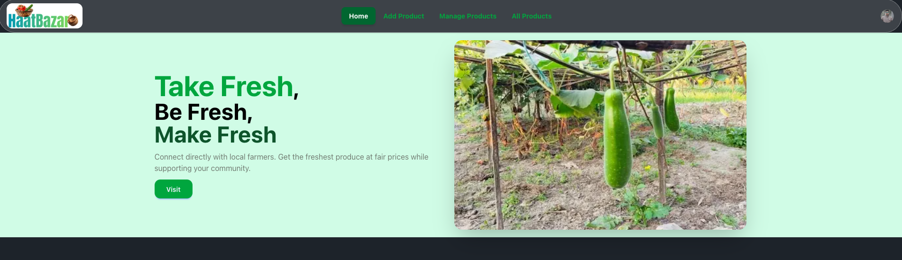
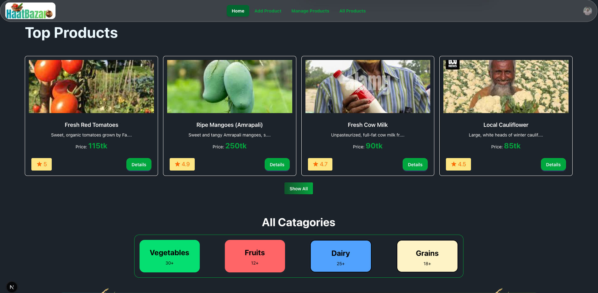
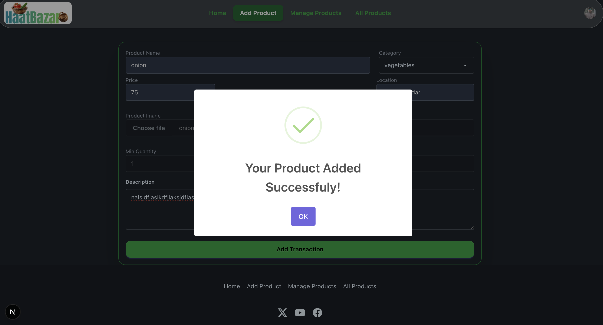

### Websit Name : HaatBazar

----

 
 
 
 
 

 ----

 ### Description:
 HaatBazar is an e-commerce based website. It's solves one of the biggest problem of Bangladeshi Raw Market, that is  Dalal (Middleman). In our website you can directly order vegetables and groceries from the farmers .By doing that, you can ensure you are getting the best ones and save a lot of money. Currently 500+ Farmers are connected with us actively. We are ensuring your health and saving your money. Our website is very user-friendly, easy to use. Check the details make sure and then order it. By that time it’s our responsibility to give you the best products.  Also, you can easily add products and manage them easily .So “ Get fresh, Make fresh, Be fresh” it’s our simple tagline. So don’t waste your time order now. Save farmers and make life fresh.

 ----

 ### Key Features of our website:
- Easy to use.
- Simple and user-friendly
- Find your product easily
- Check product details
- Easy order process
- Add product functionality 
- Manage products functionality 

----

### Technologies Used:
Frontend:Next.js
Backend: Node.js, Express.js
Authentication: Clerk
Database: mongodb
Styling: Tailwind CSS
Deployment: Varcel (Frontend)

